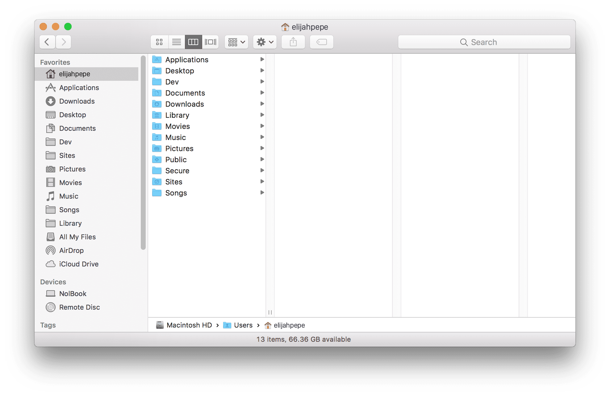
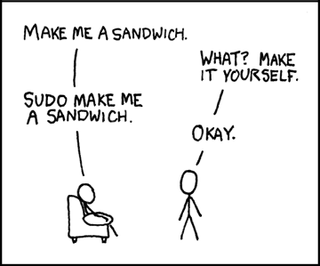
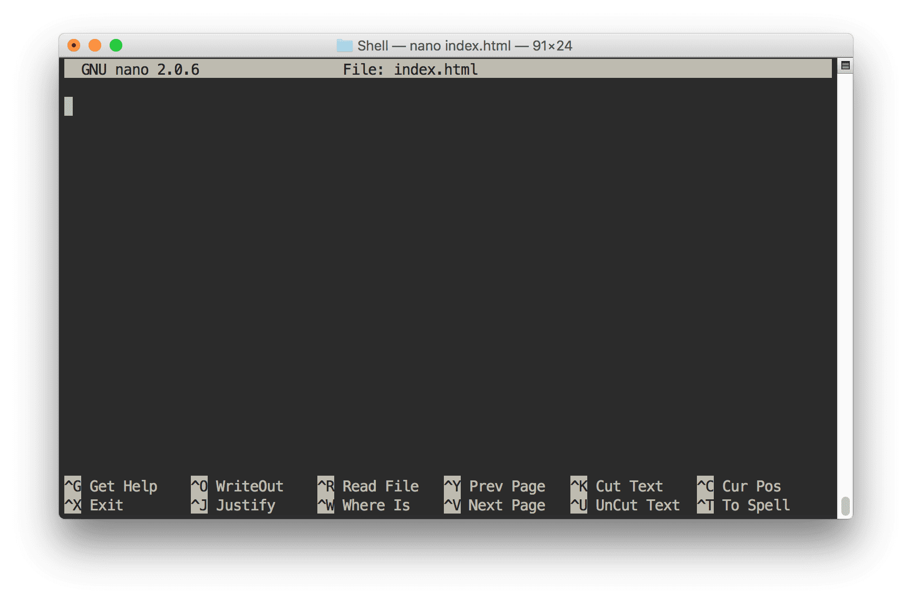
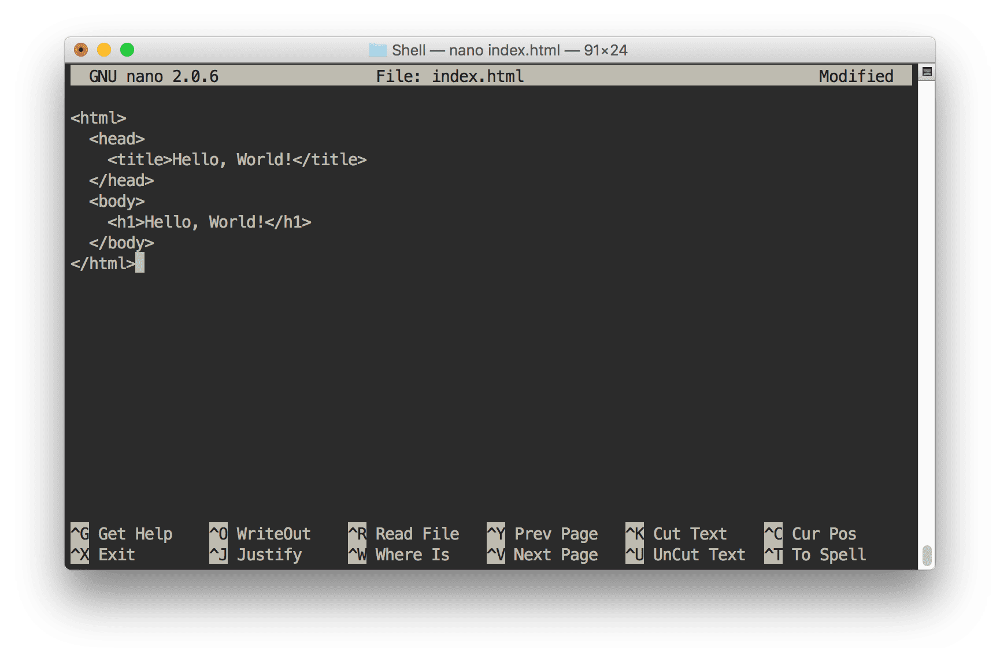

You might be like me - I used computers for almost a decade without ever touching a command prompt. I didn't know anything about it, and it seemed scary and overwhelming. I thought it was something only really advanced users knew anything about. When I inevitably encountered a situation where I had to gain some basic command line knowledge, I discovered how useful and easy it is.

Learning to use the command line will open up endless possibilities for you - it is undoubtedly essential in web development and programming, but even regular users doing everyday tasks will benefit. Follow along in this tutorial and you'll see how simple it is to use, and how powerful it can be.

If you've never used the command line, this article will be extremely helpful to you. If you have a basic or intermediate knowledge of the command line, you may learn some new tips and tricks.

> Apple macOS and most Linux servers use almost all the exact same commands, so this tutorial applies to both. Even if you use a Windows PC, this will be useful to learn as your websites are likely hosted on a Linux server.

#### Prerequisites

*   There are no prerequisites to this article - as long as you have basic computer literacy you'll be able to follow along

#### Goals

*   Learn what the command line interface is and how it relates to your computer
*   Learn some basic terminology related to the command line
*   Learn the most common, useful commands

#### What we'll learn

*   Show current directory and contents of directory
*   Moving between directories
*   Creating files and directories

    *   Write text to a file
    *   View contents of a file
*   Deleting files and directories
*   Copying and pasting files and directories
*   Moving/cutting files and directories
*   Running multiple commands
*   Changing permissions
*   Run as administrator
*   Connecting to another computer or server
*   A few more useful commands
*   Using a basic text editor

## What is the command line?

I promise this is the most important thing to understand, and it completely blew my mind when I finally understood it.

Windows, macOS - whatever operating system you're using - is simply a visual representation of your computer. This is known as a **Graphical User Interface (GUI)**. Take away the file explorer, the desktop, the icons, and all the other graphics, and you're left with the command line. Instead of dragging and dropping, pointing and clicking, you're typing. That's the only difference.

I really want to reiterate this. Your _entire_ computer can be accessed through the command line. You can do everything through the command line. It's the same computer you already know and love.

On a Mac, if I open Finder, this is my home folder. It's called `elijahpepe`.

I can access the same exact files through a web browser. If I open Firefox and I type in `/Users/elijahpepe`, I'll be in the same place.

The same is true of the command line interface. I'm going to open **Terminal.app** by opening Spotlight search (command + spacebar) and type in **Terminal**.

> My terminal background is dark. Yours might be white or blue or different depending on what you're using. This is simply a personal preference, which we can learn to change later.

Just as I was "in" the `elijahpepe` folder in Firefox and Finder, I'm currently "in" the same folder via the command prompt/terminal. I'm going to prove this by typing `pwd` into the terminal, then pressing enter. `pwd` stands for **Print Working Directory**, and will show me exactly "where I am" at any point.

Here's what I type.

    pwd

And here's what is written (printed) to the screen.

    NolBook:~ elijahpepe$ pwd
    /Users/elijahpepe

It wrote `/Users/elijahpepe` as my current working directory, where I "am". But how do I know what's there? How do I interact with any of those files and directories? I'm going to use the `ls` command, which stands for **List Directory Contents**

    ls

    NolBook:~ elijahpepe$ ls
      Desktop   Documents Library   Music     Private   Sites
      Dev       Downloads Movies    Pictures  Public    Songs

And now I see exactly what I see in Finder and Firefox!

Now you should understand that you're accessing the same files and folders from the command line as you would from any program on the computer. If it doesn't quite make sense yet, just follow along and I promise it will very soon. If you think that's incredibly simple and I spent way too much time explaining it, then you're probably a little brighter than I am.

> In programming, `print` means "show on the screen", not to be confused with "send to printer".

## Understanding the syntax

When I open terminal, I see this.

    NolBook:~ elijahpeppep$

You'll probably see something else, but the `~` and `$` will remain. Here's what's going on, which you can look back on for reference:

    Computer Name:Directory UsernameREADY

*   **Computer Name** (NolBook) - That's just the name I gave my computer.
*   **Directory** (`~` ) - Directly next to the computer name is the current directory you're working in. `~` stands for home directory, which is my `elijahpepe` folder.
*   **Username** (elijahpepe) - This might be slightly confusing because my home folder AND username are both elijahpepe, but this is specifically referring to the computer user.
*   **READY** (`$`) - A dollar sign signifies that the prompt is ready to accept your command. You do not type the `$`, it's just there. On a Windows computer, this is represented by a `>` symbol.

> A terminal or command prompt is a program (command line interface) that runs a shell, which interprets the commands.

## Commands

We're going to learn how to do a lot of the regular things you do on a computer with a mouse or keyboard shortcuts. We're going to move between directories, create files and folders, delete them, move them, copy and paste them, and edit files. You can also press `clear` at any point to wipe all the history and have a clean screen.

So far, we've learned three things.

| Command | Meaning                     | Description                                                 |
|---------|-----------------------------|-------------------------------------------------------------|
| `pwd`   | **Print Working Directory** | find out where you are                                      |
| `ls`    | **List Directory Contents** | see what files and directories are in your current location |
| `clear` | **Clear**                   | clear the terminal screen                                   |

Always remember to type `pwd` before writing any commands to make sure you know where you are.

> By default, if you quit Terminal, you will end up back in your home directory.

### Moving between directories

Right now, I'm in my home folder. If I want to move somewhere else, I will use the `cd` command - **Change Directory**. I'm going to move to the **Music** folder, then check my location. Type these commands, and press enter after each one.

    cd music
    pwd
    ls

Here is the output.

    NolBook:~ elijahpepe$ cd music
    NolBook:music elijahpepe$ pwd
    /Users/elijahpepe/music
    NolBook:music elijahpepe$ ls
    Audio Music Apps GarageBand iTunes

First, I moved to the **Music** folder. The terminal will understand a directory regardless of case, so I can write **music** or **Music**. As you can see, it says `NolBook:music` instead of `NolBook:~`, so I know I'm in a different directory now. I printed out my current location to make sure, then listed the contents.

That's great, but I don't really want to do anything in the **Music** folder. How do I go back? In the terminal, one dot (`.`) represents the current directory, and two dots (`..`) represents one directory backwards, or closer to the root.

I want to go back one directory, back into my home folder.

    cd ..

    NolBook:~ elijahpepe$

By typing `cd ..` I've told the shell to take me back one directory, and now I'm back in home/`~`. Right now would be a good time to practice moving between directories. `../..` will take you back two directories, and so on.

#### Spaces in directory and file names

If you try to move into a directory that has a space, you may encounter an issue. For example, in my **Music** folder, there was a directory called **Audio Music Apps**. However, if I try to simply type that..

    cd Audio Music Apps

    -bash: cd: Audio: No such file or directory

The shell thinks I'm trying to move into **Audio** instead of **Audio Music Apps** because it does not recognize the space. There are two ways to remedy this.

#### Using Quotations

Wrap any file in double quotes to preserve the spaces.

    cd "Audio Music Apps"

#### Escaping

Type a backslash `\` character before each space. If you press tab, the Terminal will do this for you! Simply type `cd A` and press tab and the shell will automatically assume what you want to type.

    cd Audio\ Music\ Apps/

| Command | Meaning              | Description              |
|---------|----------------------|--------------------------|
| `cd`    | **Change Directory** | move between directories |

> You can end a command at any point by pressing control + C

### Creating files and directories

You can create files and folders from the command line.

#### Create directory

Let's create a folder for practicing named **Shell** with the `mkdir` (**Make Directory**) command.

    mkdir Shell

Congratulations, you created a directory! If I type `ls`, I'll see my newly created directory in the home folder. I can also see this through Finder.

Now you can move into the **Shell** directory by inputting `cd shell`.

    NolBook:~ elijahpepe$ cd shell
    NolBook:shell elijahpepe$ pwd
    /Users/elijahpepe/shell

#### Create file

Now let's make a file. You can do this with the `touch` command. I imagine it as Merlin tapping a wand and creating something out of thin air.

    touch test.html

I'm not very unique with my example names, so I just called it **test.html**. When you input this code, it won't output anything to signify that the command was successful. You can `ls` to see it, or check in Finder that you have created a valid .html file.

You can create any sort of file, but it likely only makes sense to create text based files through terminal.

You can also create multiple files at the same time.

    touch one.txt two.txt three.txt

#### Write text to a file

We used `touch` to create an empty file, but we can even create a file on the fly with some content using `echo`.

    echo "Hello World" > hello.txt

Now I have a plain text file called **hello.txt** that contains the contents `Hello World`.

#### View contents of a file

I can check this by opening it from Finder, but I can also see the contents through Terminal with the `cat` command.

    cat hello.txt

    NolBook:shell elijahpepe$ cat hello.txt
    Hello World

At this point, I would recommend creating some more files and directories and moving between them to get more familiarized with the commands.

> These commands - `touch`, `cat`, and `echo` - can do much more than what I've shown in these quick examples.

| Command      | Meaning            | Description                  |
|--------------|--------------------|------------------------------|
| `mkdir`      | **Make Directory** | move between directories     |
| `touch`      | **Touch**          | create a new file            |
| `cat`        | **Concatenate**    | view the contents of a file  |
| `echo "x" >` | **Echo**           | quickly print text to a file |

### Deleting files and directories

Now hopefully you've make a big mess of files and directories in your testing folder, so we can start cleaning it up.

#### Delete a file

Use the `rm` (**Remove**) command to remove a file.

    rm hello.txt

Note that this will permanently delete the file - it won't send to the Trash/Recycling bin.

> The asterisk (`*`) is known as a wildcard in programming. I can choose to delete all the files of a certain filetype with a wildcard. For example, if I saved many .png files as .jpg, I could run `rm *.png` to batch delete the whole set of .png files.

#### Delete a directory

Now, let's say you create a new directory called **goodbye** with `mkdir goodbye`, and you try to delete it with `rm goodbye`. You'll get this error.

    NolBook:shell elijahpepe$ rm goodbye
    rm: goodbye: is a directory

No problem, we'll just delete it with `rmdir` (**Remove Directory**).

    rmdir goodbye

And now it's gone. If you want to remove a folder that has files in it, you'll have to run a slightly different command.

    rm -r goodbye

Just like with `touch`, we can remove multiple files or folders at the same time.

    rm one.txt two.txt three.txt

| Command | Meaning              | Description              |
|---------|----------------------|--------------------------|
| `rm`    | **Remove**           | remove directory entries |
| `rmdir` | **Remove Directory** | remove directories       |

### Copying files and directories

We can also copy and paste files through the command line with the `cp` (**Copy**) command. Simply type `cp` followed by the source (file you want to copy) and destination (place you want to copy it to).

    cp source destination

I'm in my **Shell** folder. Let's say I make a new directory called **websites** with `mkdir websites`. Now I can copy my `test.html` from `/Users/elijahpepe/shell` to `/Users/elijahpepe/shell/websites`.

    cp test.html websites

This is the same as copying and pasting (command + C).

To copy an entire directory, use the `-R` option. I can copy the **websites** directory and all of it's contents to a new directory.

    cp -R websites websites2

#### Duplicating a file

You can also duplicate a file in the same folder.

    cp test.html test2.html

### Moving files and directories

You can move files just as you copy them with the `mv` (**Move**) command.

    mv source destination

This is similar to cutting and pasting (command + X).

| Command | Meaning              | Description                                |
|---------|----------------------|--------------------------------------------|
| `cp`    | **Copy**             | copy files                                 |
| `cp -R` | **Copy Recursively** | copy a directory and all its contents      |
| `mv`    | **Move**             | move (cut and paste) files and directories |

### Running multiple commands

We can run multiple commands with the double ampersand (`&&`) operator. As long as the first command is successful, the subsequent one will run.

    touch newfile.txt && mv newfile.txt websites

I just created a new file and moved it to a different directory with one command.

### Changing permissions

File permissions aren't often taken into consideration when you're a casual Windows or Mac user, but if you've ever worked on a web server you likely have experience with permissions. You can change permissions with the `chmod` (**Change Mode**) command.

    chmod 644 test.html

I've given `644` (read and write by owner) permissions to test.html, a common permission for files.

### Run as administrator

The term `sudo` stands for Super User Do. You might encounter a situation in which the current user you're logged in as does not have sufficient permissions to perform a task. You can precede a command with `sudo` to run the command as administrator, as long as you have the admin password. When you type the password, it will _not_ show any asterisks to indicate that you've typed anything.

    sudo chmod 775 directory

You can also switch to the administrator user. This is not something you should do often, but it's useful to know. At times you will need to be logged in as admin to move between restricted directories.

    sudo su

Now my terminal looks different - it has a `#` instead of a `$` to indicate that I'm logged in as the super user.

    sh-3.2#

Since I don't really want to be logged in as admin, I'm going to `exit`, which will return me to my regular user account.

    exit

### Connecting to another computer or server

If you're a web developer or designer, you'll be familiar with connecting to a web server via FTP or SFTP. You can achieve a secure connection via the command line with `ssh` (**Secure SHell**).

You connect to the server with the same information you'd use to connect via a GUI like FileZilla or Transmit.

    ssh username@host

Once you've entered your password, you are now "inside" the other server. Your console will most likely look something like this:

    [username@host ~]$

All the commands we've already learned will work on your web host as well. You can exit the server and return to your own computer with the `exit` command.

### A few useful commands

Sometimes, when I'm having an existential crisis, I turn to my computer to bring me back to reality.

    whoami

    NolBook:~ elijahpepe$ whoami
    elijahpepe

I often need to check the IP address of a given domain when I'm migrating a website. I can do this with the `dig` (**DNS Lookup**) command.

    dig google.com

    ;; QUESTION SECTION:
    ;google.com.			IN	A

    ;; ANSWER SECTION:
    google.com.		279	IN	A	216.58.192.238

If I forget something, I can also check the help guide for the command line with `man` (**Manual**).

    man touch

    NAME
    touch -- change file access and modification times

To exit the manual pages, simply press q.

## Using a basic text editor

You may have heard of programs such as Vim or Emacs. These are Terminal-based text editors. Both of these programs have a bit of a learning curve. Most (if not all) Macs and Linux-based computers come with a program installed called **Nano**, which is a very simple text editor.

I can use the `nano` command to open a file with **Nano**.

First, I'll create a new file.

    touch index.html

Then I'll edit it with `nano`.

    nano index.html

Now my Terminal screen will look something like this.

At the top, I can see what file I'm editing (**index.html**) and at the bottom are the various commands I can do. `^` stands for control. You won't be able to use your mouse to move around or do anything except copy the contents of the file.

So I'll just type something unique.

Now to save my file, I'll press control + O (the letter), and enter to confirm. I can exit **Nano** at this point by typing control + X, and I'll be back where I started.

Now I can check the contents of **index.html** with `cat` to make sure it all worked properly.

    NolBook:shell elijahpepe$ cat index.html
      <html>
        <head>
          <title>Hello, World!</title>
        </head>
        <body>
          <h1>Hello, World!</h1>
        </body>
      </html>

## Recap

Here's a recap of all the commands I went over today.

| Command      | Meaning                     | Description                                                                          |
|--------------|-----------------------------|--------------------------------------------------------------------------------------|
| `pwd`        | **Print Working Directory** | find out where you are                                                               |
| `ls`         | **List Directory Contents** | see what files and directories are in your current location                          |
| `clear`      | **Clear**                   | clear the terminal screen                                                            |
| `cd`         | **Change Directory**        | move between directories                                                             |
| `mkdir`      | **Make Directory**          | create a new directory                                                               |
| `touch`      | **Touch**                   | create a new file                                                                    |
| `cat`        | **Concatenate**             | view the contents of a file                                                          |
| `echo "x" >` | **Echo**                    | quickly print text to a file                                                         |
| `rm`         | **Remove**                  | remove directory entries                                                             |
| `rmdir`      | **Remove Directory**        | remove directories                                                                   |
| `cp`         | **Copy**                    | copy files                                                                           |
| `cp -R`      | **Copy Recursively**        | copy a directory and all its contents                                                |
| `mv`         | **Move**                    | move (cut and paste) files and directoriesmove (cut and paste) files and directories |
| `&&`         | **And**                     | run multiple commands                                                                |
| `whoami`     | **Who Am I**                | display current user id                                                              |
| `dig`        | **Dig**                     | DNS lookup                                                                           |
| `man`        | **Manual**                  | open manual (help) pages                                                             |
| `nano`       | **Nano's ANOther editor**   | free text editing program                                                            |

## Conclusion

Now that you know how to use the command line, you can do a few things like...

*   [Run Sass from the command line](/learn-sass-now/)
*   [Set up a workflow with Gulp](/getting-started-with-gulp/)
*   [Or Grunt](/getting-started-with-grunt-and-sass/)
*   [Download all your programs with a single command](/setting-up-a-brand-new-mac-for-development/)
*   [Set up a Linux server (AWS)](/getting-started-with-aws-setting-up-a-virtual-server/)
*   [Set up a cron job](/setting-up-a-basic-cron-job-in-linux/)

and plenty more. There are no more limits! Have fun.
